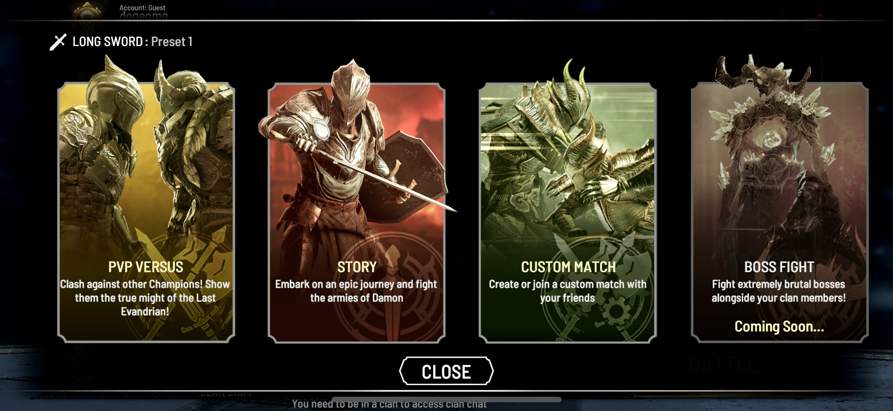
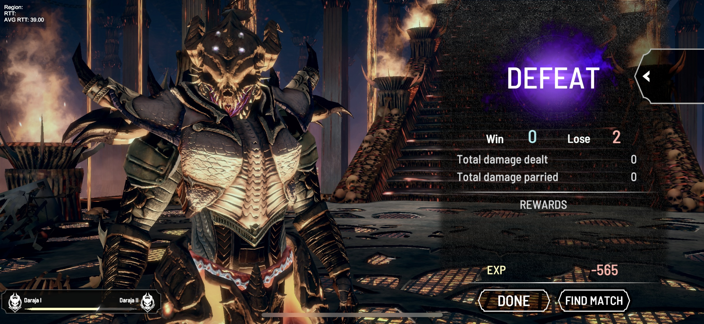
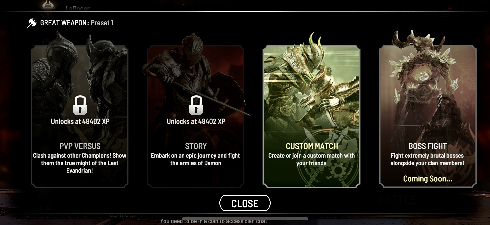
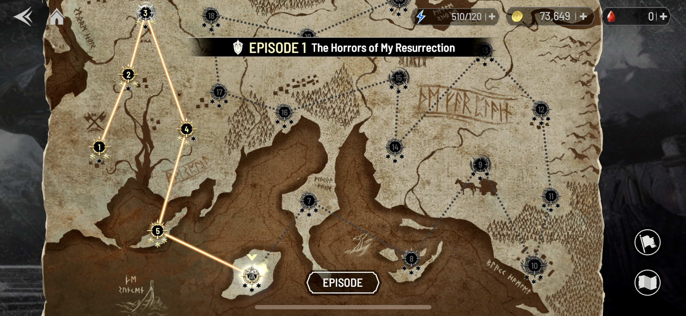
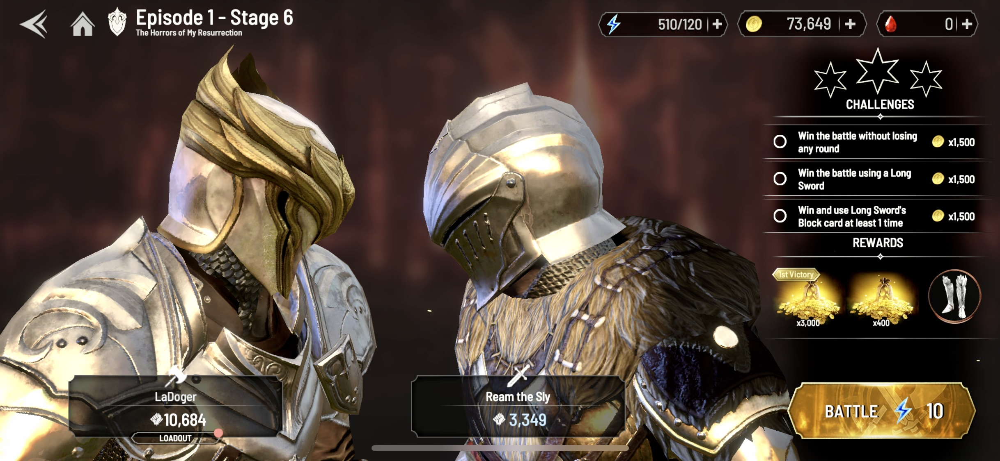

# Gamemodes

<figure><figcaption>
Gamemodes
</figcaption></figure>

### PvP Versus

PvP Versus matches players with each other. It is the main way for Knights to level up and earn items. Knights are matched based on their **level**, the **power of their items**, and the **PvP Score of the player**.

The winning Knight earns EXP and can level up; the losing Knight loses EXP! If a Knight loses too much EXP, they cannot play PvP Versus until they recover their EXP to a certain degree.

If a player wins with a CryptoKnight (on-chain Knight), they **earn additional RUBY rewards**. This is one of the "Play & Earn" aspect of the game.

<figure><figcaption>
Losing EXP in a Defeat!
</figcaption></figure>

<figure><figcaption>
Getting locked out after losing too much EXP!
</figcaption></figure>

### Story Mode (Campaign)

Story Mode is the **PvE Campaign**. The Knight embarks on an epic journey, defeat enemies, complete challenges, level up, and earn rewards.

Knights that lose too much EXP cannot participate in Story Mode until they recover.

<figure><figcaption>
A Knight's Journey
</figcaption></figure>

<figure><figcaption>
Battle with Enemies on the Way and Earn Rewards
</figcaption></figure>

### Custom Match

Friends can set a Custom Match to fight each other.

A use case of this game mode is to set up matches for **eSports Tournaments**.

### Boss Fight (Coming Soon)

Members of a **Clan team up to fight a Boss**. The Boss has a lot of Health.

The Clan with the most scores will be on the Leaderboard and win prizes.

### Tournament (Coming Soon)

Tournaments are where **Clans compete with each other**.

A Player faces an opponent that might be from any clan participating in this tournament.

Clans and Players with the most scores will be on the Leaderboard and win prizes.
