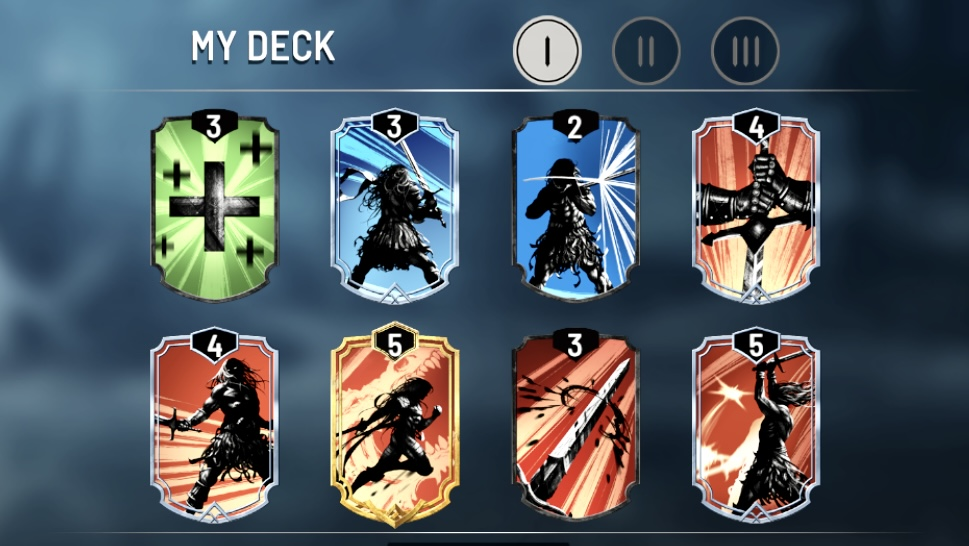

# Gameplay

### Win Condition

To win a **round**, the **opponent's HP has to go to zero**.

To win a **match**, the Knight has to **beat the opponent in a best of 3**.

### **Movement**

Use the **arrow keys** on the bottom left of the screen to **approach** or **retreat** from the opponent.

### Actions

Play from the **4 Cards in hand** which are shown on the bottom right.

The Actions are performed **real-time**. This is not a turn-based card game.

Once a Card is played, draw a new Card (the grey Card marked "NEXT").

There are **8 cards in total** in a player's Card deck.

<figure><figcaption>
A Full Deck of Cards for a Longsword Player
</figcaption></figure>

### Cards

Cards are categorized by their background color:

* **Red**: Attack
* **Blue**: Defend
* **Green**: Heal
* **Yellow**: Special
* **Purple**: Special

The numbers shown on the top of the Cards are the Stamina it consumes.

### Stamina

Stamina is used to play Cards. It is shown as a bar below your hand of Cards.

Stamina **regenerates automatically**. The maximum Stamina is 10. The state of the Knight will affect it's regeneration speed.

For example, when a Knight is attacking it's opponent, it's Stamina regenerates slower; when the Knight is standing still, it's Stamina regenerates faster.

### Health

The **Health Bars** are located at the top of the screen under the players' names.

### Endurance

A small **Endurance Bar** is shown below a Health Bar. It is by default 2 Endurance.

Endurances are depleted from a Knight when it is **attacked while performing an attack card**.

When a Knight's Endurance is 0, its attack will be **cancelled by the opponent's attack**.

The Endurance Bar takes time to automatically recharge. Then the Knight can resume attacking the opponent while being attacked.

### Timer

The **Timer** is located between the two Health Bars.

The Timer starts at 60 seconds. When it **reaches 0**, the fight enters **Overtime Phase**, both Knights start **losing health each second**.

Overtime Phase lasts for 20 seconds. When it reaches 0, the Knight with more health wins.

