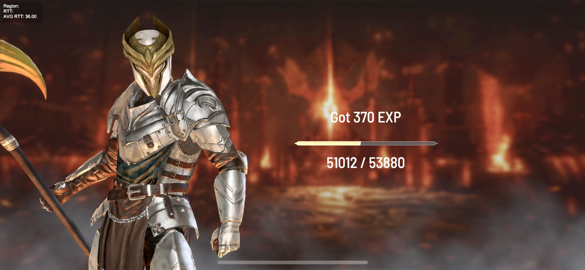

# Levels & Experience

CryptoKnights has a unique leveling system. **Levels** and **Experience (EXP)** are viewed as scarce assets!

* The main way for a Knight to gain EXP to level up is through PvP Versus.
* Winner gains EXP. Loser **loses** EXP.
* A player can **spend RUBY to restore a Knight's EXP** to its **historical max**. At launch, **1 RUBY restores 100 EXP**.
* Player should find it worthwhile to do so because higher Level Knights earn more RUBY, are stronger, and have more access to in-game features.
* **EXP slowly regenerates over time.** At launch, **1 EXP takes 1 minute to regenerate**, therefore a Knight regenerates 1,440 EXP per day.

<figure><figcaption>
A Knight gaining EXP after a victory!
</figcaption></figure>
